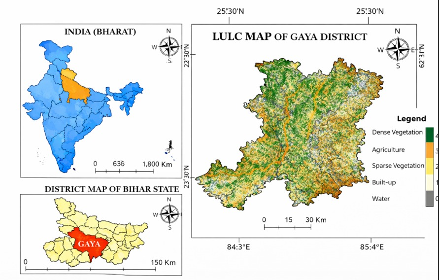
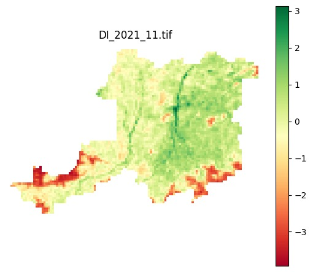

<div align="center">

#  Agricultural Drought Assessment 
### Using Multi-Sensor Remote Sensing Data Integration & Machine Learning

**A data-driven Drought Index that replaces fixed-weight climate indices with ML-derived, spatially resolved risk scoring — built for rain-fed agricultural regions where every drop of rain matters.**


</div>

---

### ▸ Overview

Gaya district, South Bihar — **4,976 km² of entirely rain-fed farmland** with no canal
irrigation — has faced worsening agricultural drought for over two decades as rainfall
patterns decline. Traditional indices like **SPI** and **PDSI** fail here: they depend on
sparse rain gauges, ignore soil moisture and vegetation stress, and rely on **fixed,
hand-picked weights** that can't adapt to local conditions.

This project fixes that. It fuses **5 satellite sensors** spanning six years of data,
trains machine learning models to predict soil moisture, and — critically — lets the
**data itself determine the weights** of a new composite Drought Index, using
permutation-based feature importance instead of guesswork.

> No field surveys. No manual tuning. Just satellite data and machine learning.

---

### ▸ Key Highlights

| | |
|---|---|
| **5 satellite sensors fused** | Sentinel-1 SAR, Landsat-8, SMAP, TRMM/GPM, Sentinel-5P |
| **Resolution range reconciled** | 15m to 36km → unified into a 1km analysis grid |
| **7 ML models benchmarked** | LightGBM selected as best performer |
| **89% R²** | on unseen 2022 test data, predicting soil moisture (NDMI) |
| **21% lower error** | vs. baseline Linear Regression |
| **5 years of drought maps** | 2018–2022, agricultural land only |
| **Self-weighting Drought Index** | weights derived from ML feature importance — zero manual tuning |

---

### ▸ The Core Idea

Traditional drought indices look like this:

```
DI = 0.28 × Precipitation + 0.24 × VH_Backscatter + ... (fixed, hand-picked weights)
```

This project replaces the guesswork with a data-driven pipeline:

```
Satellite Data  →  ML Model (LightGBM)  →  Feature Importance  →  Drought Index Weights
   (5 sensors)      (predicts NDMI)         (permutation-based)      (self-weighting)
```

The result: a Drought Index whose weights reflect what **actually predicts** soil
moisture loss in this specific region — not assumptions imported from somewhere else.

---

### ▸ Study Area at a Glance

<div align="center">

<br>
<sub>Land Use/Land Cover map of Gaya district, South Bihar — the study region</sub>
</div>

---

### ▸ Data Sources

| Sensor | Variable | Native Resolution |
|---|---|---|
| **Sentinel-1** | SAR backscatter (VV, VH) — soil moisture proxy | 15 m |
| **Landsat-8** | NDVI, NDMI, Land Surface Temperature | 30 m / 100 m |
| **TRMM / GPM IMERG** | Precipitation | ~27 km |
| **SMAP** | Soil moisture | 36 km |
| **Sentinel-5P** | CH₄, O₃ tropospheric concentration | 3.5–5.5 km |

All layers are reprojected and aligned onto a unified **1 km analysis grid**, resolving
a >2,000x difference in native resolution across sensors.

---

### ▸ Pipeline

```
1. Data Acquisition        →  Google Earth Engine (cloud masking, monthly composites)
2. Preprocessing           →  Radiometric calibration, speckle filtering, reprojection
3. Feature Engineering     →  NDVI, NDMI, VV/VH ratio, per-pixel alignment
4. Model Training          →  7 regression models, time-based split (2018–21 train / 2022 test)
5. Feature Importance      →  Permutation importance on best model (LightGBM)
6. Drought Index Formula   →  Weights = normalized feature importance scores
7. Validation              →  Cross-checked against NDVI decline & NDMI spatial patterns
```

---

### ▸ Model Performance

| Model | R² (Test) | RMSE | MAE |
|---|---|---|---|
| **LightGBM** ■ | **0.892** | **0.0415** | **0.0299** |
| Random Forest | 0.891 | 0.0417 | 0.0305 |
| XGBoost | 0.886 | 0.0426 | 0.0317 |
| Extra Trees | 0.881 | 0.0437 | 0.0312 |
| Gradient Boosting | 0.873 | 0.0451 | 0.0324 |
| Linear Regression *(baseline)* | 0.825 | 0.0528 | 0.0384 |
| MLP | 0.817 | 0.0541 | 0.0399 |

**LightGBM was selected** for its optimal balance of accuracy, training efficiency, and
interpretability — outperforming the baseline by **21% lower RMSE**.

---

### ▸ Results

- Drought severity maps generated **annually from 2018–2022**, masked to agricultural
  land only using an NDVI-based Land Use/Land Cover filter
- **Southern and south-eastern Gaya district** consistently shows the highest drought
  severity across all study years
- These high-DI zones **spatially align with independently observed vegetation
  decline** (NDVI difference maps) and reduced soil moisture (NDMI) — confirming the
  index behaves consistently with real environmental signals

<div align="center">



<sub> Drought Index map (2019) — darker red indicates higher drought severity.


</div>

---

### ▸ Tech Stack

<table>
<tr>
<td valign="top">

**Platform**
- Google Earth Engine
- Google Colab

**Language**
- Python 3.10

</td>
<td valign="top">

**Machine Learning**
- scikit-learn
- LightGBM
- XGBoost
- Random Forest
- MLP
- Linear Regression (baseline)

**Geospatial**
- Rasterio
- ArcGIS
- geemap

</td>
<td valign="top">

**Data & Viz**
- Pandas / NumPy
- Matplotlib
- Joblib

</td>
</tr>
</table>

---

### ▸ Repository Structure

```
Agricultural_Drought_Assessment/
├── notebook/
│   ├── Agricultural_Drought_full.ipynb  # Single end-to-end notebook (all stages combined)
│   ├── 01_data_acquisition.ipynb        # Google Earth Engine setup & satellite exports
│   ├── 02_preprocessing_alignment.ipynb # Reprojection, alignment, Final_dataset.csv
│   ├── 03_model_training.ipynb          # 7-model benchmark, LightGBM, feature importance
│   └── 04_drought_index_mapping.ipynb   # DI formulation & annual drought maps
├── docs/
│   ├── Final_report.pdf                 # Detailed project report
│   └── Base_Paper.pdf                   # Reference publication
├── outputs/
│   └── images/                          # Visualizations used in this README
│       ├── study_area_lulc_map.png
│       ├── drought_index_map.png
│       ├── ndvi_difference_map.png
│       └── feature_importance.png
├── .gitignore
└── README.md
```

> Raw satellite imagery (`.tif`) and full processed datasets are excluded due to size —
> see the notebook for the complete Earth Engine data pipeline and export logic.
>
> The pipeline is split into 4 stages for readability. If you prefer a single
> end-to-end notebook, see `notebook/Agricultural_Drought_full.ipynb`.

---

### ▸ Study Area

**Gaya district, South Bihar, India**
- Area: ~4,976 km²
- Climate: Tropical monsoon, ~1,133 mm average annual rainfall (declining trend)
- Irrigation: None — 100% rain-fed agriculture
- Primary crops: Rice, wheat, lentils, oilseeds

---

### ▸ Future Work

- [ ] Ground-truth validation using field-collected soil moisture data
- [ ] Integrate evapotranspiration for crop water stress modeling
- [ ] Explore LSTM/time-series models for drought forecasting
- [ ] Extend framework to other rain-fed, drought-prone regions

---

### ▸ Author

**Manasa Chinthalapalli**
· [chinthalapalli.manasa15@gmail.com](#)

---

<div align="center">
<sub>Built to make drought monitoring accessible, scalable, and free — one satellite pixel at a time.</sub>
</div>
